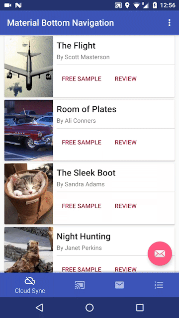
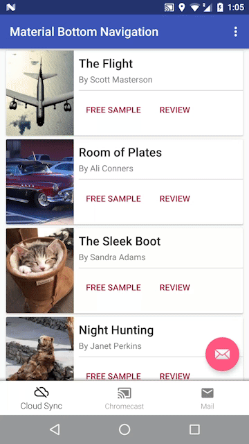
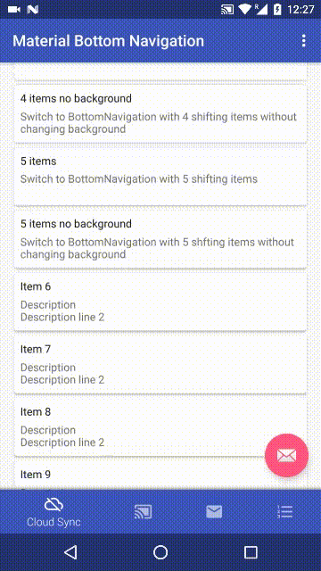
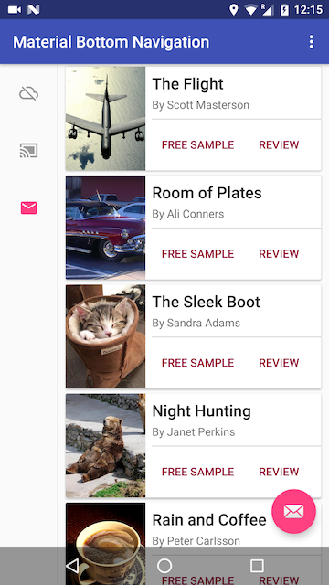
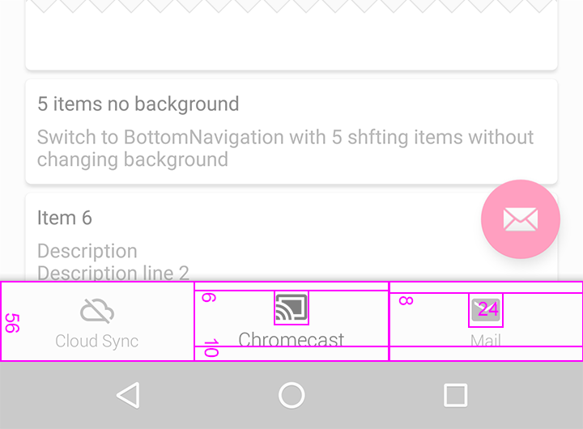

# Material Bottom Navigation Library

[](https://android-arsenal.com/details/1/3414)
[](https://travis-ci.org/sephiroth74/Material-BottomNavigation)
<br />
[](https://maven-badges.herokuapp.com/maven-central/it.sephiroth.android.library.bottomnavigation/bottom-navigation)

Lightweight Bottom Navigation library component inspired by the Google Material Design Guidelines at https://www.google.com/design/spec/components/bottom-navigation.html

This project is also inspired by https://github.com/roughike/BottomBar


Table of contents
=================

  * [Installation](#installation)
  * [Usage](#usage)
  * [Examples](#examples)
  * [Sizing](#sizing)
  * [Styling](#styling)
  * [Badges](#badges)  
    * [Badges Customization](#badges-customization)
  * [Wiki](https://github.com/sephiroth74/Material-BottomNavigation/wiki)
    * [Custom Layout Behavior](https://github.com/sephiroth74/Material-BottomNavigation/wiki/Custom-Layout-Behavior)
  * [License](#license)


Installation
=================

In your project's `build.gradle` file add the following line to the `dependencies` group:

	compile 'it.sephiroth.android.library.bottomnavigation:bottom-navigation:1.0.7'


Usage
=================
Usage of the BottomNavigation widget is very easy. Just place it in your layout.xml like this:

```xml
<?xml version="1.0" encoding="utf-8"?>
<android.support.design.widget.CoordinatorLayout android:id="@+id/CoordinatorLayout01"
	xmlns:android="http://schemas.android.com/apk/res/android"
    xmlns:app="http://schemas.android.com/apk/res-auto"
	xmlns:tools="http://schemas.android.com/tools"
    android:layout_width="match_parent"
	android:layout_height="match_parent"
    android:fitsSystemWindows="true">

	...your content...

    <it.sephiroth.android.library.bottomnavigation.BottomNavigation
	    android:id="@+id/BottomNavigation"
        android:layout_width="match_parent"
	    android:layout_height="wrap_content"
        android:layout_gravity="bottom"
	    app:bbn_entries="@menu/bottombar_menu_4items"
        app:bbn_scrollEnabled="true"
        app:bbn_badgeProvider="@string/bbn_badgeProvider"
	    app:layout_behavior="@string/bbn_phone_view_behavior" />
</android.support.design.widget.CoordinatorLayout>
```

All the menu main configurations are defined within the xml menu resource itself. Here's an example of a menu with 4 items:

```xml
<?xml version="1.0" encoding="utf-8"?>
<menu xmlns:android="http://schemas.android.com/apk/res/android"
	xmlns:app="http://schemas.android.com/apk/res-auto"
    android:background="@android:color/black"
    app:bbn_badgeColor="#FFFF0000"
	app:bbn_rippleColor="#33ffffff">
    <item
	    android:id="@+id/bbn_item1"
    	android:color="@color/colorPrimary"
        android:icon="@drawable/ic_cloud_off_white_24dp"
	    android:title="Cloud Sync" />
    <item
	    android:id="@+id/bbn_item2"
        android:color="@android:color/holo_green_dark"
	    android:icon="@drawable/ic_cast_connected_white_24dp"
        android:title="Chromecast" />
	<item
        android:id="@+id/bbn_item3"
	    android:color="@android:color/holo_orange_dark"
        android:icon="@drawable/ic_mail_white_24dp"
	    android:title="Mail" />
    <item
	    android:id="@+id/action4"
    	android:color="#FF5252"
        android:icon="@drawable/ic_format_list_numbered_white_24dp"
	    android:title="List" />
</menu>
```


Examples
=================

| 4 shifting items menu | 3 fixed items menu |
| :------------: | :-----------: |
|		|		|

| 4 items no background |  Tablet mode |
| :------------: | :-----------: |
| 4 items without changing background. <br />Menu show/hide feature is also disabled | Menu can be easily setup for (left or right) tablet support. |
|  |  |


Sizing
=================

Dimensions and paddings follow the Google giudelines<br />


# Tablets

The View supports tablet mode too (Left or Right). In order to enable tablet mode this is the configuration that should be used:

```xml
<it.sephiroth.android.library.bottomnavigation.BottomNavigation
    android:id="@+id/BottomNavigation"
    android:layout_width="match_parent"
    android:layout_height="wrap_content"
    android:layout_gravity="start"
    app:bbn_entries="@menu/bottombar_menu_3items"
    app:bbn_badgeProvider="@string/bbn_badgeProvider"
    app:layout_behavior="@string/bbn_tablet_view_behavior" />
```


Styling
=================

The xml menu supports the following attributes in the &lt;menu&gt; tag:


```xml
<declare-styleable name="BottomNavigationMenu">
    <!-- menu default background color -->
    <attr name="android:background" />
    
    <!-- default badge color -->
    <attr name="bbn_badgeColor" format="color" />

    <!-- animation duration for the menu items -->
    <attr name="bbn_itemAnimationDuration" format="integer" />

    <!-- ripple selector color -->
    <attr name="bbn_rippleColor" format="color" />

    <!-- menu item active color -->
    <attr name="bbn_itemColorActive" format="color" />

    <!-- menu item inactive color -->
    <attr name="bbn_itemColorInactive" format="color" />
</declare-styleable>
```


Badges
=================


There's a basic support for badges using the default implementation.
In order to display a badge in the current BottomNavigation view, all you have to do is:

```java
    final BadgeProvider provider = bottomNavigationView.getBadgeProvider();
    provider.show(R.id.bbn_item3);
```
            
This code will show a little circle badge on the menu item with the id "bbn_item3". <br />
You can define the default badge color inside the menu xml itself:

```xml
<menu xmlns:android="http://schemas.android.com/apk/res/android"
    xmlns:app="http://schemas.android.com/apk/res-auto"
    app:bbn_badgeColor="#FFFF0000">
    
    <item
        android:id="@+id/bbn_item1"
        android:color="@color/colorPrimary"
        android:icon="@drawable/ic_cloud_off_white_24dp"
        android:title="Cloud Sync" />
        
    ...
</menu>
```

Then you can hide the badge using:

```java
    bottomNavigation.getBadgeProvider().remove(R.id.bbn_item3);
```

Badges Customization
=================

You can use your own [Drawable](http://developer.android.com/reference/android/graphics/drawable/Drawable.html) by extending the `BadgeProvider` class. 
Once you've setup your new class you can tell the BottomNavigation view to use your class by specifying it in the "bbn_badgeProvider" attribute of your xml file. <br />
For instance:

```xml
<it.sephiroth.android.library.bottomnavigation.BottomNavigation
    android:id="@id/BottomNavigation"
    android:layout_width="match_parent"
    android:layout_height="match_parent"
    android:layout_gravity="bottom"
    app:bbn_badgeProvider="my.custom.BadgeProviderCustom"
    app:bbn_entries="@menu/bottombar_menu_4items"
    app:layout_behavior="@string/bbn_phone_view_behavior" />
```

This will make your `my.custom.BadgeProviderCustom` the default BadgeProvider.


License
=================

The MIT License (MIT)

Copyright (c) 2016 Alessandro Crugnola

Permission is hereby granted, free of charge, to any person obtaining a copy
of this software and associated documentation files (the "Software"), to deal
in the Software without restriction, including without limitation the rights
to use, copy, modify, merge, publish, distribute, sublicense, and/or sell
copies of the Software, and to permit persons to whom the Software is
furnished to do so, subject to the following conditions:

The above copyright notice and this permission notice shall be included in all
copies or substantial portions of the Software.

THE SOFTWARE IS PROVIDED "AS IS", WITHOUT WARRANTY OF ANY KIND, EXPRESS OR
IMPLIED, INCLUDING BUT NOT LIMITED TO THE WARRANTIES OF MERCHANTABILITY,
FITNESS FOR A PARTICULAR PURPOSE AND NONINFRINGEMENT. IN NO EVENT SHALL THE
AUTHORS OR COPYRIGHT HOLDERS BE LIABLE FOR ANY CLAIM, DAMAGES OR OTHER
LIABILITY, WHETHER IN AN ACTION OF CONTRACT, TORT OR OTHERWISE, ARISING FROM,
OUT OF OR IN CONNECTION WITH THE SOFTWARE OR THE USE OR OTHER DEALINGS IN THE
SOFTWARE.
